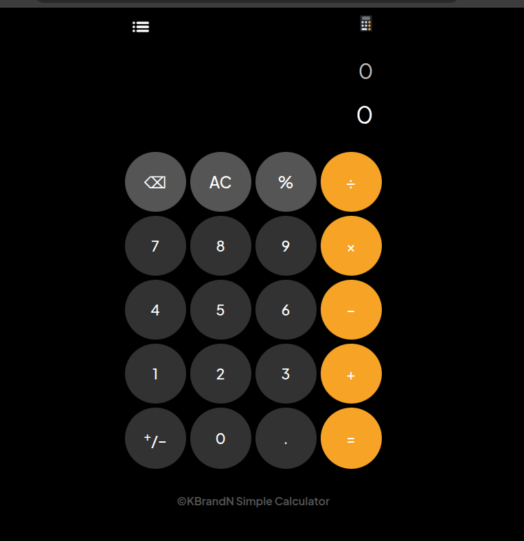

# Simple Calculator
This is a simple calculator web app developed using **HTML, CSS** and **JS**. Users of the calculator can perform basic arithmetic operation like addition, division, substraction,multiplication and modulo operation with it.You Can try it 😉.

---
## Project Architecture
```text
.simple-calculator
|_assets/exampleoutput.png
|__styles/style.css
|__index.html

```
---

## Usage
To run the simple calculator, you can clone the repository to your local machine using the following command:
```bash
git clone https://github.com/komoforbrandon/Simple-Calculator.git
```
Then, navigate to the project directory and open the `index.html` file in your web browser to use the calculator.
```bash
cd Simple-Calculator
open index.html
```
-- Alternatively, you can also use the deployed version of the calculator by visiting the following link: [https://komoforbrandon.github.io/Simple-Calculator/]

---
## Preview
open the index.html from GitHub or you can open the deployed link to use it.
- Link : [https://komoforbrandon.github.io/Simple-Calculator/]

---
## Example Output


---
## Built With
- HTML
- CSS
- JS
- with IDE VS Code

---
## Features
- Clean outputs and layout
- Mobile Responsive
- Clean and uniform backgound color
- Attractive UI

---
## Author
- Name: **Komofor Brandon**
- Github: [https://github.com/komoforbrandon]

---
## Acknowledgements
After 3 weeks of intensive JS classes with my teacher **Mr. Wadinga Leonard Ngonga** at **Rebase Code Camp**. I was able to learn alots which inpired me to built this Simple Calculator app. It's has been nice learning JS though it's a little bit complex language as everyday we get to see new words, objects and so many.
